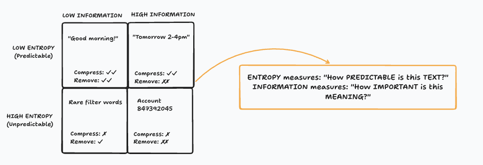

# Transcript Encoder

> **Part of Thread Encoder** — Transcript is one of the encoding modes within the **Thread Encoder** component (`clm_core/components/thread_encoder`), which is the umbrella that handles all conversation-based compression. Thread Encoder provides the underlying analysis engine, schema definitions, and language-aware pattern matching that power transcript compression.

## Overview

The Transcript Encoder is designed to compress customer service conversations between agents and customers. Unlike general conversation compression, this encoder is optimized for structured support interactions that follow predictable patterns.

**Typical characteristics:**
- Two-sided conversation (agent ↔ customer)
- Duration: 2-30 minutes
- Token count: 2,000-15,000 tokens
- Structured flow with identifiable phases

**Typical compression:** 85-92% token reduction

---

## Conversation Structure

Customer service transcripts typically follow a predictable pattern:

```
greeting → problem → troubleshooting → resolution → close
```

CLLM leverages this structure to intelligently compress while preserving semantic meaning and context.

---

## What Gets Preserved

The Transcript Encoder focuses on retaining information critical to understanding the interaction:

### ✅ Key Information (Always Preserved)

| Category | Examples |
|----------|----------|
| **Interaction Metadata** | Channel, duration, language |
| **Domain & Service** | BILLING, SUBSCRIPTION, AUTHENTICATION, etc. |
| **Customer Intent** | Derived from customer utterances (REPORT_DUPLICATE_CHARGE, REQUEST_REFUND) |
| **Context Provided** | PII-safe fact-of-information (EMAIL_PROVIDED, BOOKING_ID_PROVIDED) |
| **Agent Actions** | Ordered chain of agent operations (ACCOUNT_VERIFIED→REFUND_INITIATED) |
| **System Actions** | Automated events (PAYMENT_RETRY_DETECTED, AUTO_ESCALATION_TRIGGERED) |
| **Resolution** | Outcome type (ISSUE_RESOLVED, ESCALATED) |
| **State** | Authoritative status (RESOLVED, PENDING_SETTLEMENT, ESCALATED) |
| **Commitments** | SLA or promised actions (REFUND_3-5_DAYS, FOLLOWUP_BY_FRIDAY) |
| **Artifacts** | Structured identifiers (REFUND_REF=RFD-908712, ORDER_ID=ORD-123) |
| **Sentiment Trajectory** | Emotional journey (NEUTRAL→GRATEFUL) |

### ❌ What Gets Discarded

Information that provides little to no value is safely removed:

- **Pleasantries**: "Good morning, how are you today?"
- **Filler words**: "um", "uh", "you know", "like"
- **Repetition**: Agent restating customer's issue
- **Hold announcements**: "Please hold while I check..."
- **Redundant confirmations**: "Okay", "I see", "Got it"
- **Generic closing phrases**: "Have a great day"
- **Small talk**: Weather, sports, unrelated conversation

---

## CLM vs. Traditional Approaches

Traditional compression methods focus on removing words, which often loses structure and context. CLLM compresses **meaning** by extracting semantic structure.

### Traditional Approach

```
Original:
"Agent: Good morning, thank you for calling TechCorp support. 
My name is Sarah. How may I assist you today?"

↓ Remove fluff

Result:
"Agent Sarah TechCorp support internet issue 3 days..."

❌ Still verbose
❌ Lost structure
❌ Unclear relationships
```

### CLM Approach (v2)

```
Original:
[Same greeting + issue description + troubleshooting + resolution]

↓ Extract semantic structure

Result:
[INTERACTION:SUPPORT:CHANNEL=VOICE] [DOMAIN:TECHNICAL]
[CUSTOMER_INTENT:REPORT_INTERNET_OUTAGE]
[AGENT_ACTIONS:ACCOUNT_VERIFIED→DIAGNOSTIC_PERFORMED]
[RESOLUTION:ISSUE_RESOLVED] [STATE:RESOLVED]
[SENTIMENT:FRUSTRATED→SATISFIED]

✅ Massive compression (85-92%)
✅ Structure preserved
✅ Semantic relationships intact
✅ All key information retained
✅ PII-safe context representation
```



---

## Example: Complete Transcript Compression

### Input Transcript

```python
from clm_core import CLMConfig, CLMEncoder

# Billing Issue - Customer Support Transcript
transcript = """Customer: Hi Raj, I noticed an extra charge on my card for my plan this month. It looks like I was billed twice for the same subscription.
Agent: I'm sorry to hear that, let's take a look together. Can I have your account email or billing ID to verify your record?
Customer: Sure, it's melissa.jordan@example.com.
Agent: Thanks, Melissa. Give me just a moment... alright, I can see two transactions on your file — one processed on the 2nd and another on the 3rd. It seems the system retried payment even after the first one succeeded.
Customer: Oh wow, that explains it. So I'm not crazy then.
Agent: Not at all. It's a known issue we had earlier this week with duplicate processing. The good news is, you're eligible for a full refund on the second charge.
Customer: Great. How long will it take to show up?
Agent: Once I file the refund, it usually reflects within 3–5 business days depending on your bank. I'll also send you a confirmation email with the reference number.
Customer: That works. Thank you for sorting it out so quickly.
Agent: My pleasure. I've just submitted the refund request now — your reference number is RFD-908712. You should see that update later today.
Customer: Perfect. I appreciate your help, Raj.
Agent: Anytime! Is there anything else I can check for you today?
Customer: No, that's all. Thanks again!
Agent: Thank you for calling us, Melissa. Have a great day ahead!"""

# Configure encoder
cfg = CLMConfig(lang="en")
encoder = CLMEncoder(cfg=cfg)

# Compress with metadata
result = encoder.encode(
    input_=transcript, 
    metadata={
        'call_id': 'CX-0001', 
        'agent': 'Raj', 
        'duration': '9m', 
        'channel': 'voice', 
        'issue_type': 'Billing Dispute'
    }
)

print(result.compressed)
```

### Compressed Output (v2)

```text
[INTERACTION:SUPPORT:CHANNEL=VOICE]
[DURATION=6m]
[LANG=EN]
[DOMAIN:BILLING]
[SERVICE:SUBSCRIPTION]
[CUSTOMER_INTENT:REPORT_DUPLICATE_CHARGE]
[CONTEXT:EMAIL_PROVIDED]
[AGENT_ACTIONS:ACCOUNT_VERIFIED→DIAGNOSTIC_PERFORMED→REFUND_INITIATED]
[SYSTEM_ACTIONS:PAYMENT_RETRY_DETECTED]
[RESOLUTION:ISSUE_RESOLVED]
[STATE:RESOLVED]
[COMMITMENT:REFUND_3-5_DAYS]
[ARTIFACT:REFUND_REF=RFD-908712]
[SENTIMENT:NEUTRAL→GRATEFUL]
```

### What's Preserved

| Element                 | Original | Compressed |
|-------------------------|----------|------------|
| **Interaction**         | Voice support call | `INTERACTION:SUPPORT:CHANNEL=VOICE` |
| **Metadata**            | 7-minute call, English | `DURATION=7m`, `LANG=EN` |
| **Domain/Service**      | Billing issue, payment processing | `DOMAIN:BILLING`, `SERVICE:PAYMENT` |
| **Customer Intent**     | "extra charge… billed twice" | `CUSTOMER_INTENT:REPORT_BILLING_ISSUE` |
| **Interaction Trigger** | Duplicate charge detected by customer | `INTERACTION_TRIGGER:DUPLICATE_CHARGE` |
| **Context**             | Customer provided email and name | `CONTEXT:EMAIL_PROVIDED`, `CONTEXT:NAME_PROVIDED` |
| **Root Cause**          | System retried payment after success | `SYSTEM_ACTIONS:PAYMENT_RETRY_DETECTED` |
| **Agent Actions**       | Looked up account, diagnosed issue, confirmed duplicate, notified customer | `AGENT_ACTIONS:ACCOUNT_LOOKUP→TROUBLESHOOT→DIAGNOSTIC_PERFORMED→DUPLICATE_CHARGE_CONFIRMED→CUSTOMER_NOTIFIED` |
| **Resolution/State**    | Refund processed and case closed | `STATE:RESOLVED` |
| **Commitments**         | Confirmation email + refund in 3–5 business days | `COMMITMENT:CONFIRMATION_EMAIL`, `COMMITMENT:REFUND_3-5_BUSINESS_DAYS` |
| **Artifact**            | Refund reference "RFD-908712" | `ARTIFACT:REFUND_REF=RFD-908712` |
| **Sentiment Arc**       | Neutral → Satisfied → Grateful | `SENTIMENT:NEUTRAL→SATISFIED→GRATEFUL` |
### Compression Metrics

```
Original: ~1,450 tokens
Compressed: ~145 tokens
Reduction: 90%
Processing time: 73% faster
Semantic preservation: ✅ Complete
```

---

## Configuration

The Transcript Encoder uses a simple configuration approach. All analysis decisions — what to extract, what to drop — are handled automatically by CLM's internal NLP pipeline and language dictionary.

### Basic Configuration

```python
from clm_core import CLMConfig, CLMEncoder

# Minimal configuration
cfg = CLMConfig(lang="en")
encoder = CLMEncoder(cfg=cfg)
```

### Configuration Options

```python
cfg = CLMConfig(
    lang="en",                    # Language: en, pt, es, fr
    redaction_pattern=r"\[.*?\]"  # Optional: detect redacted PII fields
)
```

| Parameter | Type | Default | Description |
|-----------|------|---------|-------------|
| `lang` | `str` | `"en"` | Language for NLP model and dictionary |
| `redaction_pattern` | `str` | Built-in | Regex pattern to detect redacted PII in text |

### Language-Specific Behavior

When you select a language, CLM automatically:
- Loads the appropriate spaCy model
- Applies language-specific action and intent vocabulary
- Uses the corresponding semantic dictionary
- Adjusts entity recognition patterns

```python
# English
cfg_en = CLMConfig(lang="en")  # Uses en_core_web_sm

# Portuguese
cfg_pt = CLMConfig(lang="pt")  # Uses pt_core_news_sm

# Spanish
cfg_es = CLMConfig(lang="es")  # Uses es_core_news_sm

# French
cfg_fr = CLMConfig(lang="fr")  # Uses fr_core_news_sm
```

---

## Advanced Usage

### With Custom Metadata

Metadata enhances compression by providing context about the conversation:

```python
result = encoder.encode(
    input_=transcript,
    metadata={
        'call_id': 'CX-12345',
        'agent': 'Sarah Chen',
        'team': 'Billing Support',
        'duration': '15m30s',
        'channel': 'phone',
        'issue_type': 'Payment Dispute',
        'priority': 'high',
        'customer_tier': 'premium'
    }
)
```

The encoder incorporates relevant metadata into the compressed output, creating richer context for downstream LLM processing.

### Batch Processing

For processing multiple transcripts:

```python
transcripts = [
    {'id': 'CX-001', 'text': transcript1, 'metadata': {...}},
    {'id': 'CX-002', 'text': transcript2, 'metadata': {...}},
    {'id': 'CX-003', 'text': transcript3, 'metadata': {...}}
]

results = []
for item in transcripts:
    result = encoder.encode(
        input_=item['text'],
        metadata=item['metadata']
    )
    results.append({
        'id': item['id'],
        'compressed': result.compressed,
        'ratio': result.compression_ratio,
        'original_tokens': result.original_tokens,
        'compressed_tokens': result.compressed_tokens
    })

# Save compressed results
import json
with open('compressed_transcripts.json', 'w') as f:
    json.dump(results, f, indent=2)
```

### Accessing Compression Details

The result object provides detailed compression information:

```python
result = encoder.encode(input_=transcript, metadata=metadata)

# Basic compression info
print(f"Compressed text: {result.compressed}")
print(f"Original tokens: {result.n_tokens}")
print(f"Compressed tokens: {result.c_tokens}")
print(f"Compression ratio: {result.compression_ratio:.1f}%")
```

### Structured Output — `to_dict()`

Parse the compressed token string into a typed Python dictionary for downstream use (APIs, databases, analytics):

```python
data = result.to_dict()

print(data["channel"])         # "VOICE"
print(data["domain"])          # "BILLING"
print(data["customerIntent"])  # "REPORT_DUPLICATE_CHARGE"
print(data["state"])           # "RESOLVED"
print(data["agentActions"])    # ["ACCOUNT_VERIFIED", "DIAGNOSTIC_PERFORMED", "REFUND_INITIATED"]
print(data["commitments"])     # [{"type": "REFUND", "etaDays": 4}]
print(data["artifacts"])       # [{"key": "REFUND_REF", "value": "RFD-908712"}]
print(data["sentiment"])       # ["NEUTRAL", "GRATEFUL"]
```

All recognised token fields are present in the dict; tokens absent from the output have `None` as their value. See the [Thread Encoder index](index.md) for the full dict schema.

See [Case-Dependent Features](#case-dependent-features) for accessing resolution state, refund details, timeline, and agent promises via the raw analysis object.

---

## Token Structure (v2 Schema)

CLM Transcript Schema v2 uses a sequence of structured semantic blocks. Each transcript produces tokens in a fixed order:

### INTERACTION Token
Interaction metadata:
```
[INTERACTION:SUPPORT:CHANNEL=VOICE|CHAT|EMAIL|SLACK]
```

### DURATION Token
Call duration (approximate minutes):
```
[DURATION=6m]
```

### LANG Token
Language metadata:
```
[LANG=EN|ES|PT|FR]
```

### DOMAIN Token
Explicit service area classification:
```
[DOMAIN:BILLING]
[DOMAIN:AUTHENTICATION]
[DOMAIN:BOOKINGS]
[DOMAIN:API]
[DOMAIN:PERFORMANCE]
```

### SERVICE Token
Service area within domain:
```
[SERVICE:SUBSCRIPTION]
[SERVICE:HOST_STAY]
[SERVICE:PAYMENT]
[SERVICE:DASHBOARD]
[SERVICE:EXPORTS]
```

### CUSTOMER_INTENT Token (Mandatory)
Derived strictly from customer utterances (not inferred from agent actions):
```
[CUSTOMER_INTENT:REPORT_DUPLICATE_CHARGE]
[CUSTOMER_INTENT:REQUEST_REFUND]
[CUSTOMER_INTENT:ACCOUNT_UNLOCK]
[CUSTOMER_INTENT:FEATURE_INQUIRY]
[CUSTOMER_INTENT:CANCEL_BOOKING]
```

One primary intent required. When a secondary intent is detected, both are encoded together:
```
[CUSTOMER_INTENTS:PRIMARY=REQUEST_SHIPMENT_STATUS;SECONDARY=DISPUTE_SERVICE_FEE]
```

### INTERACTION_TRIGGER Token (Optional)
Encodes *why* the issue occurred — the root cause or trigger event that prompted the customer to contact support. This is distinct from customer intent (what they want) and agent actions (what was done):
```
[INTERACTION_TRIGGER:FIELD_LOCKED]
[INTERACTION_TRIGGER:MISSING_DELIVERY]
[INTERACTION_TRIGGER:DUPLICATE_AUTHORIZATION]
[INTERACTION_TRIGGER:AUTO_ESCALATION_TRIGGERED]
```

### CONTEXT Token
Indicates fact-of-information without leaking PII:
```
[CONTEXT:EMAIL_PROVIDED]
[CONTEXT:BOOKING_ID_PROVIDED]
[CONTEXT:PAYMENT_METHOD_PROVIDED]
[CONTEXT:PAYMENT_METHOD_REDACTED]
```

### AGENT_ACTIONS Token
Operational actions performed by agent, joined as an ordered chain:
```
[AGENT_ACTIONS:ACCOUNT_VERIFIED→DIAGNOSTIC_PERFORMED→REFUND_INITIATED]
[AGENT_ACTIONS:ACCOUNT_UNLOCKED]
[AGENT_ACTIONS:API_KEY_ROTATED→ESCALATED_TIER2]
```

### SYSTEM_ACTIONS Token (Optional)
Automated system-level events:
```
[SYSTEM_ACTIONS:PAYMENT_RETRY_DETECTED]
[SYSTEM_ACTIONS:AUTO_ESCALATION_TRIGGERED→SLA_BREACH_DETECTED]
```

### RESOLUTION Token
Describes outcome type:
```
[RESOLUTION:ISSUE_RESOLVED]
[RESOLUTION:ACCOUNT_UNLOCKED]
[RESOLUTION:ANSWER_PROVIDED]
[RESOLUTION:ESCALATED]
```

### STATE Token (Mutually Exclusive)
Authoritative interaction status — only one STATE per transcript:
```
[STATE:RESOLVED]
[STATE:PENDING_SETTLEMENT]
[STATE:PENDING_CUSTOMER]
[STATE:ESCALATED]
[STATE:UNRESOLVED]
```

### COMMITMENT Token
Encodes SLA or promised actions:
```
[COMMITMENT:REFUND_3-5_DAYS]
[COMMITMENT:FOLLOWUP_BY_FRIDAY]
[COMMITMENT:CALLBACK_24h]
```

### ARTIFACT Token
Structured identifiers:
```
[ARTIFACT:REFUND_REF=RFD-908712]
[ARTIFACT:REFUND_AMT=$14.99]
[ARTIFACT:BOOKING_ID=XYZ123]
[ARTIFACT:ORDER_ID=ORD-456]
[ARTIFACT:TRACKING_ID=TRK-789]
```

### SENTIMENT Token (Optional)
Conversation-level sentiment trajectory:
```
[SENTIMENT:FRUSTRATED→NEUTRAL→SATISFIED]
[SENTIMENT:NEUTRAL→GRATEFUL]
[SENTIMENT:ANGRY→CALM→GRATEFUL]
```

See [Token Hierarchy](../advanced/clm_tokenization.md) for complete details.

---

## v2 Design Principles

CLM Transcript Schema v2 follows these design principles:

1. **Customer intent must be explicit** — derived from customer utterances, not inferred from agent actions
2. **Domain/service context must be explicit** — classification of the interaction area
3. **Agent and system actions must be separated** — human actions vs automated events
4. **Resolution and state must not conflict** — RESOLUTION describes outcome type, STATE is authoritative status
5. **PII must be protected** — CONTEXT tokens indicate fact-of-information without leaking data
6. **Fields must be operationally useful** — every token serves analytics, routing, or SLA tracking
7. **Schema must remain compact and versioned** — `CLM_SCHEMA_VERSION=2.0`

### Taxonomy Governance

To avoid semantic drift, the schema enforces limits:

- DOMAIN types: 20–30 max
- CUSTOMER_INTENT types: 20–40 max
- ACTION types: 30–50 max
- STATE types: 5–10 max
- All enum changes must increment schema version

### Accessing Analysis Details

The full analysis is available on the `TranscriptAnalysis` object:

```python
result = encoder.encode(input_=transcript, metadata=metadata)

# Access via the analysis object
analysis = encoder.analysis

# Domain and intent
print(f"Domain: {analysis.domain}")
print(f"Service: {analysis.service}")
print(f"Intent: {analysis.customer_intent}")

# Context provided
for ctx in analysis.context_provided:
    print(f"Context: {ctx}")

# Resolution state
if analysis.resolution_state:
    print(f"State: {analysis.resolution_state.type}")
    print(f"CSAT: {analysis.resolution_state.customer_satisfaction}")
    print(f"Follow-up: {analysis.resolution_state.follow_up_needed}")

# Refund details (only present for billing cases)
if analysis.refund_reference:
    print(f"Ref: {analysis.refund_reference.reference_number}")
    print(f"Amount: {analysis.refund_reference.amount}")

# Promises / Commitments
for promise in analysis.promises:
    print(f"Commitment: {promise.type} - {promise.description}")
    print(f"  Timeline: {promise.timeline}, Confidence: {promise.confidence}")

# System actions
for action in analysis.system_actions:
    print(f"System: {action}")
```

---

## Use Cases

### Quality Assurance

Compress transcripts for QA analysis — the semantic tokens preserve compliance markers, agent actions, and resolution state exactly as-is:

```python
result = encoder.encode(
    input_=transcript,
    metadata={
        'call_id': 'QA-20240115-001',
        'agent': 'Sarah Chen',
        'team': 'Billing Support',
        'channel': 'voice'
    }
)

# Feed the compressed token string into your QA scoring LLM
qa_input = result.compressed
```

### Agent Performance Analysis

Track agent behavior patterns by collecting the structured dict from many calls:

```python
result = encoder.encode(input_=transcript, metadata=metadata)
call_data = result.to_dict()

# Fields directly useful for performance tracking
agent_actions   = call_data["agentActions"]   # Ordered action chain
state           = call_data["state"]           # RESOLVED / ESCALATED / etc.
sentiment_arc   = call_data["sentiment"]       # ["FRUSTRATED", "SATISFIED"]
commitments     = call_data["commitments"]     # [{type, etaDays}]
```

### Training Data Preparation

Create compressed datasets for LLM training:

```python
training_samples = []
for item in raw_transcripts:
    result = encoder.encode(
        input_=item['text'],
        metadata=item['metadata']
    )
    training_samples.append({
        'input': result.compressed,
        'compression_ratio': result.compression_ratio,
        'structured': result.to_dict()
    })
```

---

## Best Practices

### 1. Provide Rich Metadata

The more context you provide, the better the compression:

```python
# Good - Rich metadata
metadata = {
    'agent': 'Sarah Chen',
    'call_id': 'CX-12345',
    'duration': '8m45s',
    'channel': 'phone',
    'issue_type': 'Billing',
    'customer_tier': 'premium',
    'previous_calls': 3
}

# Minimal - Still works but less context
metadata = {'agent': 'Sarah', 'duration': '8m'}
```

### 2. Validate Compressed Output

For critical applications, validate that essential information is preserved:

```python
result = encoder.encode(input_=transcript, metadata=metadata)

# Check compression ratio is within expected range
assert 0.75 <= result.compression_ratio <= 0.95, "Unexpected compression ratio"

# Verify key v2 tokens are present
assert 'INTERACTION:' in result.compressed, "Interaction metadata missing"
assert 'CUSTOMER_INTENT:' in result.compressed, "Customer intent missing"
assert 'STATE:' in result.compressed, "State missing"
```

### 4. Handle Long Transcripts

For very long calls (>15k tokens), consider segmenting:

```python
def compress_long_transcript(transcript, max_tokens=10000):
    """Compress transcripts longer than max_tokens in segments."""
    if count_tokens(transcript) <= max_tokens:
        return encoder.encode(input_=transcript)
    
    # Segment by conversation phases
    segments = segment_by_phase(transcript)  # greeting, issue, resolution, etc.
    
    compressed_segments = []
    for segment in segments:
        result = encoder.encode(input_=segment['text'])
        compressed_segments.append(result.compressed)
    
    return ' '.join(compressed_segments)
```

---

## Performance Optimization

### Caching

For repeated compression of similar transcripts:

```python
from functools import lru_cache

@lru_cache(maxsize=1000)
def get_encoder(lang: str):
    """Cached encoder initialization."""
    cfg = CLMConfig(lang=lang)
    return CLMEncoder(cfg=cfg)

# Reuse encoder across calls
encoder = get_encoder('en')
result1 = encoder.encode(input_=transcript1)
result2 = encoder.encode(input_=transcript2)
```

### Parallel Processing

For large batches:

```python
from concurrent.futures import ProcessPoolExecutor

def compress_transcript(item):
    cfg = CLMConfig(lang='en')
    encoder = CLMEncoder(cfg=cfg)
    return encoder.encode(input_=item['text'], metadata=item['metadata'])

# Process in parallel
with ProcessPoolExecutor(max_workers=4) as executor:
    results = list(executor.map(compress_transcript, transcripts))
```

---

## Troubleshooting

### Low Compression Ratio

If compression is lower than expected:

```python
# Check if clm_core is already concise
if result.compression_ratio < 0.70:
    print("Warning: Low compression ratio")
    print(f"Original tokens: {result.original_tokens}")
    # Transcript might already be compressed or lack redundancy
```

### Missing Information

If key details are lost, check that the transcript uses clear speaker labels (e.g. `Agent:` / `Customer:`) and that the relevant vocabulary exists in the language dictionary. For redacted fields, ensure `redaction_pattern` matches your format:

```python
cfg = CLMConfig(lang="en", redaction_pattern=r"\[.*?\]")
encoder = CLMEncoder(cfg=cfg)
```

### Language Detection Issues

For mixed-language transcripts:

```python
# Specify primary language
cfg = CLMConfig(lang="en")  # Handles English with some non-English words
# For truly multilingual, process separately by language
```

---

## Next Steps

- **[Thread Encoder Overview](index.md)** - Architecture, `ThreadOutput.to_dict()`, data models
- **[System Prompt Encoding](../sys_prompt/index.md)** - Compress agent instructions
- **[Structured Data Encoding](../sd_encoder.md)** - Compress NBA catalogs
- **[Advanced: Token Hierarchy](../advanced/clm_tokenization.md)** - Deep dive into token structure
- **[Advanced: CLM Dictionary](../advanced/clm_dictionary.md)** - Language-specific vocabularies

---
