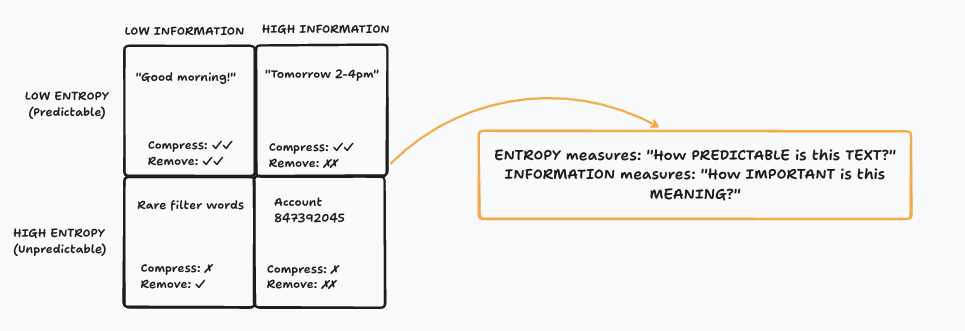

# Transcript Encoder

## Overview

The Transcript Encoder is designed to compress customer service conversations between agents and customers. Unlike general conversation compression, this encoder is optimized for structured support interactions that follow predictable patterns.

**Typical characteristics:**
- Two-sided conversation (agent ↔ customer)
- Duration: 2-30 minutes
- Token count: 2,000-15,000 tokens
- Structured flow with identifiable phases

**Typical compression:** 85-92% token reduction

---

## Conversation Structure

Customer service transcripts typically follow a predictable pattern:

```
greeting → problem → troubleshooting → resolution → close
```

CLLM leverages this structure to intelligently compress while preserving semantic meaning and context.

---

## What Gets Preserved

The Transcript Encoder focuses on retaining information critical to understanding the interaction:

### ✅ Key Information (Always Preserved)

| Category | Examples |
|----------|----------|
| **Customer Issue** | What's wrong, error messages, symptoms |
| **Customer Context** | Name, account details, history, sentiment |
| **Actions Taken** | Troubleshooting steps, verification processes |
| **Outcomes** | What worked, what didn't, next steps |
| **Resolution** | How the call ended, follow-up required |
| **Temporal Sequence** | Order of events (critical for troubleshooting) |
| **Sentiment Trajectory** | Emotional journey (frustrated → satisfied) |
| **Performance Metrics** | Agent quality indicators, compliance markers |

### ❌ What Gets Discarded

Information that provides little to no value is safely removed:

- **Pleasantries**: "Good morning, how are you today?"
- **Filler words**: "um", "uh", "you know", "like"
- **Repetition**: Agent restating customer's issue
- **Hold announcements**: "Please hold while I check..."
- **Redundant confirmations**: "Okay", "I see", "Got it"
- **Generic closing phrases**: "Have a great day"
- **Small talk**: Weather, sports, unrelated conversation

---

## CLM vs. Traditional Approaches

Traditional compression methods focus on removing words, which often loses structure and context. CLLM compresses **meaning** by extracting semantic structure.

### Traditional Approach

```
Original:
"Agent: Good morning, thank you for calling TechCorp support. 
My name is Sarah. How may I assist you today?"

↓ Remove fluff

Result:
"Agent Sarah TechCorp support internet issue 3 days..."

❌ Still verbose
❌ Lost structure
❌ Unclear relationships
```

### CLM Approach

```
Original:
[Same greeting + issue description + troubleshooting + resolution]

↓ Extract semantic structure

Result:
[CALL:SUPPORT:AGENT=Sarah] [ISSUE:INTERNET:DURATION=3_DAYS] 
[ACTION:TROUBLESHOOT:RESULT=COMPLETED] [RESOLUTION:RESOLVED]

✅ Massive compression (85-92%)
✅ Structure preserved
✅ Semantic relationships intact
✅ All key information retained
```



---

## Example: Complete Transcript Compression

### Input Transcript

```python
from clm_core import CLMConfig, CLMEncoder

# Billing Issue - Customer Support Transcript
transcript = """Customer: Hi Raj, I noticed an extra charge on my card for my plan this month. It looks like I was billed twice for the same subscription.
Agent: I'm sorry to hear that, let's take a look together. Can I have your account email or billing ID to verify your record?
Customer: Sure, it's melissa.jordan@example.com.
Agent: Thanks, Melissa. Give me just a moment... alright, I can see two transactions on your file — one processed on the 2nd and another on the 3rd. It seems the system retried payment even after the first one succeeded.
Customer: Oh wow, that explains it. So I'm not crazy then.
Agent: Not at all. It's a known issue we had earlier this week with duplicate processing. The good news is, you're eligible for a full refund on the second charge.
Customer: Great. How long will it take to show up?
Agent: Once I file the refund, it usually reflects within 3–5 business days depending on your bank. I'll also send you a confirmation email with the reference number.
Customer: That works. Thank you for sorting it out so quickly.
Agent: My pleasure. I've just submitted the refund request now — your reference number is RFD-908712. You should see that update later today.
Customer: Perfect. I appreciate your help, Raj.
Agent: Anytime! Is there anything else I can check for you today?
Customer: No, that's all. Thanks again!
Agent: Thank you for calling us, Melissa. Have a great day ahead!"""

# Configure encoder
cfg = CLMConfig(lang="en")
encoder = CLMEncoder(cfg=cfg)

# Compress with metadata
result = encoder.encode(
    input_=transcript, 
    metadata={
        'call_id': 'CX-0001', 
        'agent': 'Raj', 
        'duration': '9m', 
        'channel': 'voice', 
        'issue_type': 'Billing Dispute'
    }
)

print(result.compressed)
```

### Compressed Output

```text
[CALL:SUPPORT:AGENT=Raj:DURATION=9m:CHANNEL=voice] 
[CUSTOMER] [CONTACT:EMAIL=melissa.jordan@example.com] 
[ISSUE:BILLING_DISPUTE:SEVERITY=LOW] 
[ACTION:TROUBLESHOOT:RESULT=COMPLETED] 
[ACTION:REFUND:REFERENCE=RFD-908712:TIMELINE=3-5_DAYS:RESULT=COMPLETED] 
[RESOLUTION:RESOLVED:TIMELINE=TODAY] 
[SENTIMENT:NEUTRAL→SATISFIED→GRATEFUL]
```

### What's Preserved

| Element | Original | Compressed |
|---------|----------|------------|
| **Agent Identity** | "Hi Raj" / "your help, Raj" | `AGENT=Raj` |
| **Customer Contact** | "melissa.jordan@example.com" | `EMAIL=melissa.jordan@example.com` |
| **Issue Type** | "extra charge... billed twice" | `BILLING_DISPUTE:SEVERITY=LOW` |
| **Root Cause** | "system retried payment after first succeeded" | Implicit in `ACTION:TROUBLESHOOT` |
| **Resolution** | "full refund... 3-5 business days" | `ACTION:REFUND:TIMELINE=3-5_DAYS` |
| **Reference** | "RFD-908712" | `REFERENCE=RFD-908712` |
| **Sentiment Arc** | Concerned → Satisfied → Grateful | `NEUTRAL→SATISFIED→GRATEFUL` |

### Compression Metrics

```
Original: ~1,450 tokens
Compressed: ~145 tokens
Reduction: 90%
Processing time: 73% faster
Semantic preservation: ✅ Complete
```

---

## Configuration

The Transcript Encoder uses a simple configuration approach. Most complexity is handled automatically by CLLM's internal dictionary and language rules.

### Basic Configuration

```python
from clm_core import CLMConfig, CLMEncoder

# Minimal configuration
cfg = CLMConfig(lang="en")
encoder = CLMEncoder(cfg=cfg)
```

### Configuration Options

```python
cfg = CLMConfig(
    lang="en",                          # Language: en, pt, es, fr
    compression_level=2,                # 1=conservative, 2=balanced, 3=aggressive
    preserve_numbers=True,              # Keep numeric values
    preserve_entities=True,             # Keep names, emails, etc.
    extract_sentiment=True,             # Track sentiment trajectory
    track_actions=True,                 # Preserve action sequences
    include_metadata=True               # Use provided metadata
)
```

### Language-Specific Behavior

When you select a language, CLLM automatically:
- Loads the appropriate spaCy model
- Applies language-specific compression rules
- Uses the corresponding semantic dictionary
- Adjusts entity recognition patterns

```python
# English
cfg_en = CLMConfig(lang="en")  # Uses en_core_web_sm

# Portuguese
cfg_pt = CLMConfig(lang="pt")  # Uses pt_core_news_sm

# Spanish
cfg_es = CLMConfig(lang="es")  # Uses es_core_news_sm

# French
cfg_fr = CLMConfig(lang="fr")  # Uses fr_core_news_sm
```

---

## Advanced Usage

### With Custom Metadata

Metadata enhances compression by providing context about the conversation:

```python
result = encoder.encode(
    input_=transcript,
    metadata={
        'call_id': 'CX-12345',
        'agent': 'Sarah Chen',
        'team': 'Billing Support',
        'duration': '15m30s',
        'channel': 'phone',
        'issue_type': 'Payment Dispute',
        'priority': 'high',
        'customer_tier': 'premium'
    }
)
```

The encoder incorporates relevant metadata into the compressed output, creating richer context for downstream LLM processing.

### Batch Processing

For processing multiple transcripts:

```python
transcripts = [
    {'id': 'CX-001', 'text': transcript1, 'metadata': {...}},
    {'id': 'CX-002', 'text': transcript2, 'metadata': {...}},
    {'id': 'CX-003', 'text': transcript3, 'metadata': {...}}
]

results = []
for item in transcripts:
    result = encoder.encode(
        input_=item['text'],
        metadata=item['metadata']
    )
    results.append({
        'id': item['id'],
        'compressed': result.compressed,
        'ratio': result.compression_ratio,
        'original_tokens': result.original_tokens,
        'compressed_tokens': result.compressed_tokens
    })

# Save compressed results
import json
with open('compressed_transcripts.json', 'w') as f:
    json.dump(results, f, indent=2)
```

### Accessing Compression Details

The result object provides detailed compression information:

```python
result = encoder.encode(input_=transcript, metadata=metadata)

# Basic compression info
print(f"Compressed text: {result.compressed}")
print(f"Original tokens: {result.original_tokens}")
print(f"Compressed tokens: {result.compressed_tokens}")
print(f"Compression ratio: {result.compression_ratio:.1%}")

# Additional metadata (if verbose=True)
if hasattr(result, 'metadata'):
    print(f"Entities extracted: {result.metadata.get('entities')}")
    print(f"Actions identified: {result.metadata.get('actions')}")
    print(f"Sentiment trajectory: {result.metadata.get('sentiment')}")
```

---

## Token Structure

Transcript compression uses specific token categories:

### CALL Token
Provides conversation context:
```
[CALL:SUPPORT:AGENT=Name:DURATION=Xm:CHANNEL=phone|chat|email]
```

### CUSTOMER Token
Customer identification and contact:
```
[CUSTOMER] [CONTACT:EMAIL=user@example.com]
[CUSTOMER:NAME=John_Doe:TIER=premium]
```

### ISSUE Token
Problem description:
```
[ISSUE:BILLING_DISPUTE:SEVERITY=LOW|MEDIUM|HIGH]
[ISSUE:TECHNICAL:CATEGORY=INTERNET:DURATION=3_DAYS]
```

### ACTION Token
Actions taken during the call:
```
[ACTION:TROUBLESHOOT:RESULT=COMPLETED|FAILED]
[ACTION:REFUND:REFERENCE=REF123:TIMELINE=3-5_DAYS]
[ACTION:ESCALATE:TEAM=TIER2:REASON=COMPLEX]
```

### RESOLUTION Token
Call outcome:
```
[RESOLUTION:RESOLVED:TIMELINE=TODAY|PENDING]
[RESOLUTION:FOLLOW_UP:DATE=2024-01-15]
```

### SENTIMENT Token
Emotional trajectory:
```
[SENTIMENT:FRUSTRATED→NEUTRAL→SATISFIED]
[SENTIMENT:ANGRY→CALM→GRATEFUL]
```

See [Token Hierarchy](advanced/clm_tokenization.md) for complete details.

---

## Use Cases

### Quality Assurance

Compress transcripts for QA analysis while preserving compliance markers:

```python
# QA-focused compression
qa_result = encoder.encode(
    input_=transcript,
    metadata={
        'qa_focus': True,
        'compliance_check': True,
        'extract_policy_violations': True
    }
)
```

### Agent Performance Analysis

Track agent behavior and effectiveness:

```python
# Performance-focused compression
perf_result = encoder.encode(
    input_=transcript,
    metadata={
        'track_response_time': True,
        'identify_upsell_opportunities': True,
        'measure_empathy_indicators': True
    }
)
```

### Training Data Preparation

Create compressed datasets for LLM training:

```python
# Prepare training data
training_samples = []
for transcript in raw_transcripts:
    compressed = encoder.encode(
        input_=transcript['text'],
        metadata=transcript['metadata']
    )
    training_samples.append({
        'input': compressed.compressed,
        'expected_output': transcript['expected_analysis'],
        'compression_ratio': compressed.compression_ratio
    })
```

---

## Best Practices

### 1. Provide Rich Metadata

The more context you provide, the better the compression:

```python
# Good - Rich metadata
metadata = {
    'agent': 'Sarah Chen',
    'call_id': 'CX-12345',
    'duration': '8m45s',
    'channel': 'phone',
    'issue_type': 'Billing',
    'customer_tier': 'premium',
    'previous_calls': 3
}

# Minimal - Still works but less context
metadata = {'agent': 'Sarah', 'duration': '8m'}
```

### 2. Choose Appropriate Compression Level

```python
# Conservative - Maximum information retention
cfg = CLMConfig(lang="en", compression_level=1)  # ~75-80% compression

# Balanced - Good trade-off (default)
cfg = CLMConfig(lang="en", compression_level=2)  # ~85-90% compression

# Aggressive - Maximum compression
cfg = CLMConfig(lang="en", compression_level=3)  # ~90-95% compression
```

### 3. Validate Compressed Output

For critical applications, validate that essential information is preserved:

```python
result = encoder.encode(input_=transcript, metadata=metadata)

# Check compression ratio is within expected range
assert 0.75 <= result.compression_ratio <= 0.95, "Unexpected compression ratio"

# Verify key entities are present
assert 'AGENT=' in result.compressed, "Agent name missing"
assert 'ISSUE:' in result.compressed, "Issue type missing"
assert 'RESOLUTION:' in result.compressed, "Resolution missing"
```

### 4. Handle Long Transcripts

For very long calls (>15k tokens), consider segmenting:

```python
def compress_long_transcript(transcript, max_tokens=10000):
    """Compress transcripts longer than max_tokens in segments."""
    if count_tokens(transcript) <= max_tokens:
        return encoder.encode(input_=transcript)
    
    # Segment by conversation phases
    segments = segment_by_phase(transcript)  # greeting, issue, resolution, etc.
    
    compressed_segments = []
    for segment in segments:
        result = encoder.encode(input_=segment['text'])
        compressed_segments.append(result.compressed)
    
    return ' '.join(compressed_segments)
```

---

## Performance Optimization

### Caching

For repeated compression of similar transcripts:

```python
from functools import lru_cache

@lru_cache(maxsize=1000)
def get_encoder(lang: str):
    """Cached encoder initialization."""
    cfg = CLMConfig(lang=lang)
    return CLMEncoder(cfg=cfg)

# Reuse encoder across calls
encoder = get_encoder('en')
result1 = encoder.encode(input_=transcript1)
result2 = encoder.encode(input_=transcript2)
```

### Parallel Processing

For large batches:

```python
from concurrent.futures import ProcessPoolExecutor

def compress_transcript(item):
    cfg = CLMConfig(lang='en')
    encoder = CLMEncoder(cfg=cfg)
    return encoder.encode(input_=item['text'], metadata=item['metadata'])

# Process in parallel
with ProcessPoolExecutor(max_workers=4) as executor:
    results = list(executor.map(compress_transcript, transcripts))
```

---

## Troubleshooting

### Low Compression Ratio

If compression is lower than expected:

```python
# Check if transcript is already concise
if result.compression_ratio < 0.70:
    print("Warning: Low compression ratio")
    print(f"Original tokens: {result.original_tokens}")
    # Transcript might already be compressed or lack redundancy
```

### Missing Information

If key details are lost:

```python
# Use conservative compression
cfg = CLMConfig(lang="en", compression_level=1, preserve_entities=True)
encoder = CLMEncoder(cfg=cfg)
```

### Language Detection Issues

For mixed-language transcripts:

```python
# Specify primary language
cfg = CLMConfig(lang="en")  # Handles English with some non-English words
# For truly multilingual, process separately by language
```

---

## Next Steps

- **[System Prompt Encoding](sys_prompt/index.md)** - Compress agent instructions
- **[Structured Data Encoding](sd_encoder.md)** - Compress NBA catalogs
- **[Advanced: Token Hierarchy](advanced/clm_tokenization.md)** - Deep dive into token structure
- **[Advanced: CLM Dictionary](advanced/clm_dictionary.md)** - Language-specific vocabularies

---
